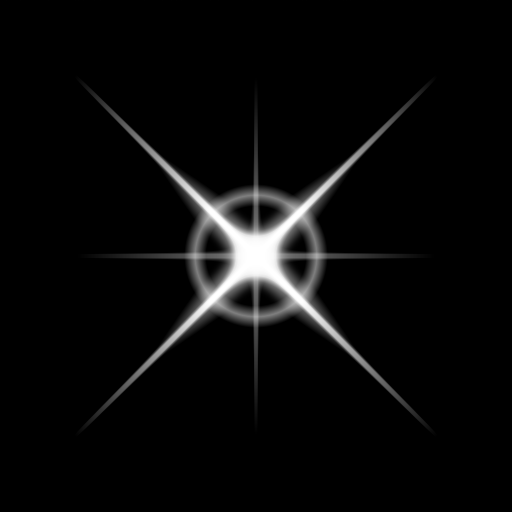

# 点

点可以用来模拟雾化、星光等效果

## 粒子

创建一个球体，并在球的顶点上添加上纹理贴图

```js {4}
const sphereGeom = new SphereGeometry(3, 40, 40);

const bufferGeom = new BufferGeometry();
bufferGeom.setAttribute('position', sphereGeom.getAttribute('position'));
```

创建相应的点材质，并加载纹理



```ts
import pointColor from '../assets/points/color-2.png';

const texture = textureLoader.load(pointColor as string, (texture) => {
  texture.colorSpace = SRGBColorSpace;
});

const pointsMaterial = new PointsMaterial({ color: 0x00ff00, size: 0.5 });
pointsMaterial.map = texture;
pointsMaterial.alphaMap = texture;
pointsMaterial.transparent = true;
pointsMaterial.depthWrite = false;
pointsMaterial.blending = AdditiveBlending;

const points = new Points(bufferGeom, pointsMaterial);
scene.add(points);
```

点材质PointsMaterial的属性

- depthWrite：模拟出更真实的效果，只渲染前面的物体，被遮盖的物体则不渲染
- blending：模拟物体相互叠加的效果
  - AdditiveBlending表示两个的效果相加，例如：一个物体是浅红色，被遮挡的物体也是浅红色，那么在叠加之后，前面物体的颜色更红

<script setup>
import Points from './codes/points.vue';
import Galaxy from './codes/galaxy.vue';

</script>

<ClientOnly>
    <Points></Points>
</ClientOnly>

### 模拟星河

<ClientOnly>
    <Galaxy></Galaxy>
</ClientOnly>
